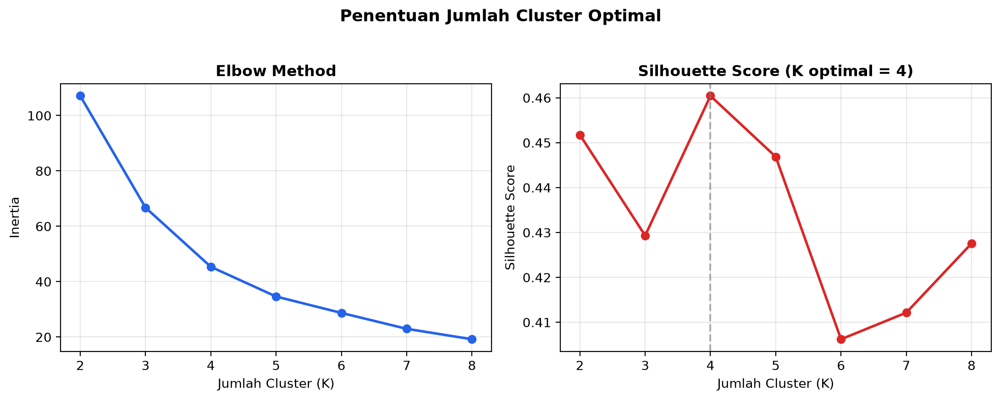
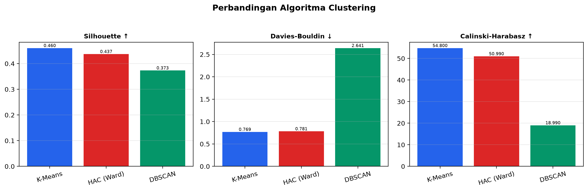
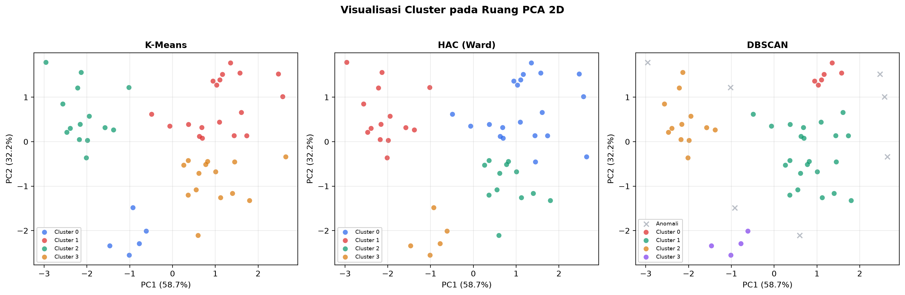
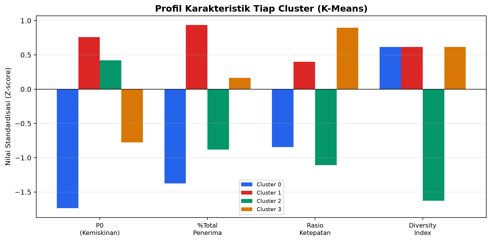
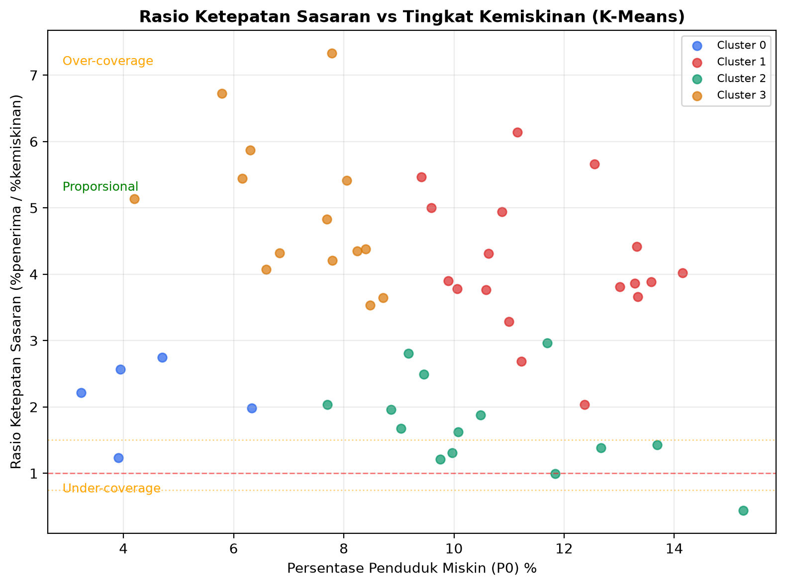

# Clustering Wilayah untuk Deteksi Disparitas Ketepatan Sasaran Penyaluran BPNT dan PKH

**Nama:** Abraham Rusty Djajani  
**NIM:** 535240007  
**Email:** abraham.535240007@stu.untar.ac.id  

---

## Overview

Proyek ini melakukan clustering wilayah berdasarkan indikator ketepatan sasaran penyaluran bantuan sosial (Bansos) BPNT dan PKH menggunakan data BPS. Tujuannya adalah mengelompokkan kabupaten/kota ke dalam cluster yang merepresentasikan tingkat ketepatan sasaran, serta membandingkan performa tiga algoritma clustering.

## Dataset

| Data | Tahun | Wilayah | Sumber |
|---|---|---|---|
| Persentase Penduduk Miskin (P0) | 2025 | 515 kab/kota (Indonesia) | BPS |
| BPNT (Non-Cash Food Assistance) | 2024 | 18 kab/kota (Sumatera Selatan) | BPS |
| BPNT + PKH | 2023 | 35 kab/kota (Jawa Tengah) | BPS |
| BPNT + PKH | 2021 | 6 kab/kota (DKI Jakarta) | BPS |

**Final dataset:** 51 kabupaten/kota setelah merging dan filtering.

## Fitur

| Fitur | Deskripsi |
|---|---|
| `p0_persen` | Persentase penduduk miskin |
| `pct_total_penerima` | Persentase rumah tangga penerima bansos (BPNT + PKH) |
| `rasio_ketepatan_sasaran` | `pct_total_penerima / p0_persen` |
| `diversity_index` | Jumlah jenis bansos dengan cakupan > 1% |

## Metodologi

### Algoritma Clustering
1. **K-Means** — Partitional clustering dengan inisialisasi acak
2. **HAC (Ward)** — Hierarchical agglomerative clustering dengan linkage Ward
3. **DBSCAN** — Density-based clustering untuk deteksi anomali

### Evaluasi
- **Silhouette Score** — Kohesi dan separasi cluster
- **Davies-Bouldin Index (DBI)** — Rata-rata similaritas antar cluster
- **Calinski-Harabasz Index** — Rasio varians antar cluster dan dalam cluster

## Hasil

### K Optimal
- **K = 4** (Silhouette Score = 0.4604)

### Perbandingan Algoritma

| Algoritma | Silhouette | DBI | Calinski-Harabasz |
|---|---|---|---|
| K-Means (K=4) | **0.4604** | **0.7686** | **54.80** |
| HAC (Ward) (K=4) | 0.4370 | 0.7814 | 50.99 |
| DBSCAN (eps=0.7) | 0.3731 | 2.6414 | 18.99 |

### Interpretasi Cluster (K-Means)

| Cluster | Jumlah Wilayah | P0 Rata-rata | Rasio Ketepatan | Label |
|---|---|---|---|---|
| 0 | 5 | 4.42% | 2.15 | Over-coverage — P0 rendah |
| 1 | 18 | 11.67% | 4.15 | Over-coverage — P0 tinggi |
| 2 | 14 | 10.69% | 1.73 | Tepat Sasaran — Kemiskinan Sedang/Tinggi |
| 3 | 14 | 7.22% | 4.95 | Over-coverage — P0 sedang |

### Temuan
- Seluruh wilayah dalam sampel menunjukkan rasio ketepatan > 1.5, mengindikasikan cakupan bansos melebihi proporsi penduduk miskin.
- Pola ini konsisten di Sumatera Selatan, Jawa Tengah, dan DKI Jakarta.
- **DBSCAN** mengidentifikasi **7 wilayah (13.7%)** sebagai anomali yang menjadi prioritas verifikasi lapangan.

## Output

### Gambar

**1. Penentuan K Optimal (Elbow + Silhouette)**



**2. Perbandingan Algoritma Clustering**



**3. Visualisasi Cluster PCA 2D**



**4. Profil Karakteristik Cluster**



**5. Rasio Ketepatan vs Tingkat Kemiskinan**



### CSV
| File | Deskripsi |
|---|---|
| `hasil_clustering_wilayah.csv` | Hasil clustering per wilayah lengkap dengan label |
| `profil_cluster.csv` | Statistik rata-rata fitur per cluster |
| `perbandingan_algoritma.csv` | Perbandingan metrik evaluasi antar algoritma |

## Cara Menjalankan

```bash
# 1. Clone repo
git clone https://github.com/RustyRustacle/bansos-clustering-analysis.git
cd bansos-clustering-analysis

# 2. Buat virtual environment
python3 -m venv venv
source venv/bin/activate

# 3. Install dependencies
pip install -r requirements.txt

# 4. Jalankan notebook
jupyter notebook run_analisis_bansos.ipynb
```

## Requirements

- Python 3.9+
- numpy, pandas, matplotlib, scikit-learn
- openpyxl, xlrd (baca file Excel)
- jupyter, nbconvert, ipykernel

## Tools

- **Python** — bahasa pemrograman
- **Jupyter Notebook** — environment interaktif
- **scikit-learn** — library clustering & preprocessing
- **pandas** — manipulasi data
- **matplotlib** — visualisasi

## Lisensi

Proyek ini dibuat untuk tujuan akademis.
